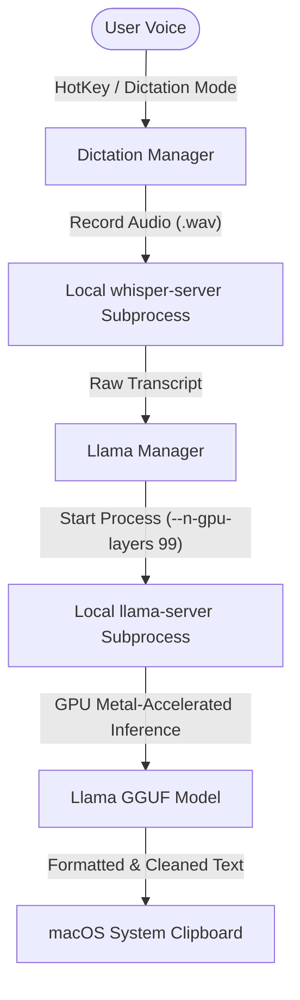

<p align="center">
  
</p>
<h1 align="center">Atoll (Andrew's Fork) — AI Dictation & DynamicIsland Workspace</h1>

<p align="center">
  <a href="https://github.com/angdulu/andy-dynamic-island/stargazers">
    
  </a>
  <a href="https://github.com/angdulu/andy-dynamic-island/releases">
    
  </a>
</p>

An advanced, customized fork of **Atoll for macOS** that transforms the MacBook notch utility into a privacy-first, local AI-driven dictation and post-processing workspace. 

While preserving the core system insights and media widgets, this fork integrates an **on-device Speech-to-Text (STT) transcriber** and a **Metal-GPU accelerated Local LLM cleanup pipeline**.

---

## 🧠 Custom Architecture: Local AI Dictation Workspace

This fork introduces a **Dictation-Only Mode** and custom local daemon bindings designed to run private LLMs locally on macOS:



### 1. The Speech-to-Text Daemon (`DictationManager.swift`)
- Integrates a precompiled **Whisper C/C++ server binary** (`whisper-server`) directly into the macOS application bundle.
- Manages recording state, playing custom sound cues (`whisper_begin.wav`, `whisper_end.wav`) to signify recording intervals.
- Handles audio capture and streams `.wav` buffers to the local Whisper daemon, returning a raw text transcript in real-time.

### 2. Apple Silicon Metal-Accelerated Post-Processing (`LlamaManager.swift`)
- Bundles a custom **llama-server** executable with matching dynamic libraries (`libllama`, `libggml-metal`, etc.) to run GGUF models locally.
- **Metal GPU Acceleration:** Starts the server subprocess with `--n-gpu-layers 99` and `--threads 4`, offloading model evaluation entirely to Apple Silicon Unified Memory for immediate, sub-second inference.
- **Prompt Injection Defense:** Wraps the transcription in XML tags (`<transcription>...</transcription>`) within the structured system prompt, preventing the AI from executing commands spoken in the dictation text.
- **Dynamic Model Fetching:** Features an asynchronous model downloader (`URLSessionDownloadTask`) that installs GGUF models directly to the macOS Application Support folder with SHA-256 integrity verification.
- **Output:** Automatically cleans up grammatical errors, false starts, and stuttering before copying the polished, publication-ready text directly to the system clipboard.

---

## 🌟 Highlights & Original Features

- **Dictation-Only Mode:** A toggle that disables lock screen widgets, Dynamic Island panel hover behaviors, and sound effects, converting the app into a focused, background dictation daemon.
- **Media Controls:** Dynamic widgets for Apple Music, Spotify, and system volume with inline previews.
- **System Insight:** Real-time displays for CPU, GPU, memory, network, and disk health metrics.
- **Productivity Panel:** Built-in timers, calendar widgets, clipboard history managers, and color pickers.

---

## 💻 Tech Stack

- **UI Framework:** SwiftUI 5 / AppKit
- **Core AI Runtimes:** Custom C++ wrappers for `llama.cpp` and `whisper.cpp`
- **Build Tooling:** Xcode 15+ / Swift Package Manager (SPM)

---

## 🔧 Subprocess Configuration Detail

To load the bundled `.dylib` library dependencies in macOS sandbox-compliant environments, `LlamaManager` modifies its subprocess launch environment:
```swift
var env = ProcessInfo.processInfo.environment
let binDir = serverBinary.deletingLastPathComponent().path
env["DYLD_LIBRARY_PATH"] = binDir
process.environment = env
```
This forces the macOS dynamic loader to locate `libggml-metal.dylib` and other key dependencies packaged inside the App bundle, allowing portable local inference without system-wide library installations.

---

## 📦 Requirements & Installation

- **OS:** macOS 14.0 or later (Optimized for Apple Silicon M1/M2/M3/M4 Macs).
- **Hardware:** MacBook with a notch (14/16-inch MBP).
- **Development Tooling:** Xcode 15+ (if compiling from source).

To run locally:
1. Clone the repository:
   ```bash
   git clone https://github.com/angdulu/andy-dynamic-island.git
   ```
2. Open `DynamicIsland.xcodeproj` in Xcode.
3. Build and run (requires granting Accessibility and Audio Recording permissions).

---

## 📜 Acknowledgments & License

This project is released under the **GPL v3 License**.

It builds upon the work of several exceptional open-source projects:
- [**Boring.Notch**](https://github.com/TheBoredTeam/boring.notch) - Foundation for media integration and notches.
- [**Alcove**](https://tryalcove.com) - Inspiration for widget layout.
- [**Stats**](https://github.com/exelban/stats) - SMC CPU reading architecture.
- [**llama.cpp**](https://github.com/ggerganov/llama.cpp) & [**whisper.cpp**](https://github.com/ggerganov/whisper.cpp) - Core AI engines.
